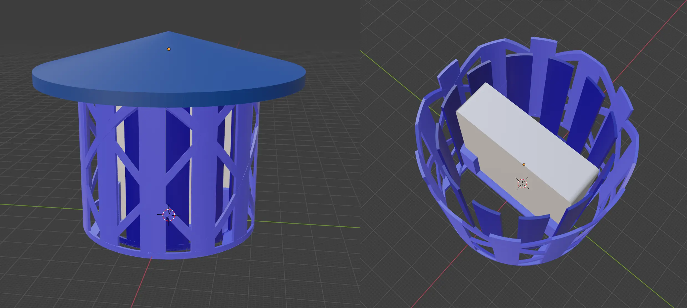
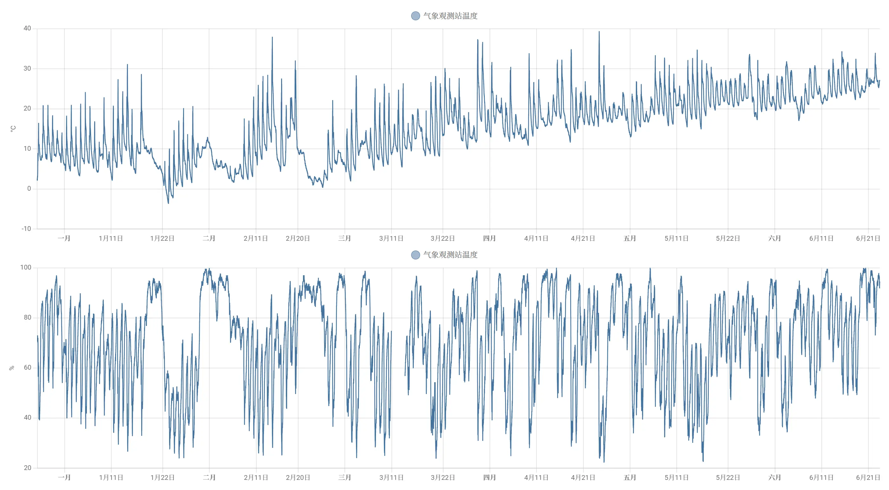

# 气象观测站！

大家有用过电子温度计吗？

比如说感觉很热的时候就要脱衣服嘛，但是实际温度可能不1定很热，有可能是催眠ojisan在偷偷制造很热的幻觉，好让你把衣服脱掉！这个时候我们就可以看温度计，如果温度计没有很热，就说明他躲在附近了！

但是电子温度计如果放在户外的话，会因为日晒雨淋很快坏掉！

好在聪明的莉沫酱发明了气象观测装甲，把电子温度计变成可以放在户外的气象观测站，这样1来就可以随时监控户外的气象，出门就不会被催眠ojisan抓住了！

## 模型

这个模型的结构是这样的，左边的图是正面，右边是把盖子拿掉以后从上面看的。

- 最上面的圆锥形的部分是盖子。
    - 防水的同时也有隔热的效果，这样太阳直射的时候温度计不会爆炸。
- 浅蓝和深蓝色的部分是侧面的防水屏障。
    - 主要是防止风把雨水吹到里面来，类似正规的气象观测站的百叶窗，但是3D打印不好打1体成型的百叶窗，所以改成了这种在Z(?)方向上交错的设计。
    - 只能挡1些小的雨，台风来了会怎么样我也没试过，不过应该是会挂掉！
- 中间白色的部分不用打印，是放[米家蓝牙温湿度计2](https://item.jd.com/100010622784.html)的。
    - 没有的话可以去京东买1个，现在只要22.9元！

## 效果

我把这个在窗户外面放了6个月，还没挂，而且收集到的数据看起来挺正常的，说明可靠性还不错！

这6个月的温度和湿度看起来是这样:

数据是用Home Assistant收集的，只要配置1下就好了，很方便，所以这个仓库里并没有代码。

## 注意

- 盖子和下面的部分要分开打印，再粘起来，要不然就没办法把温度计放进去了。

- 盖子打印的时候要用蜂窝形状的填充，这样隔热效果好，不要打成实心或者空心的。

- 下面的圈从打印机里取出来的时候不要太大力，可能会断。

- 放在窗户外面之后要用双面胶粘住，要不然会被风吹走。

## 结束

就这样，我要去探测催眠ojisan了，大家88！
